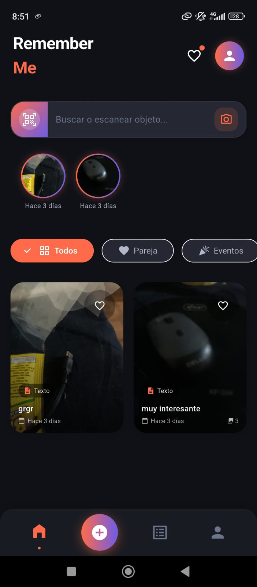
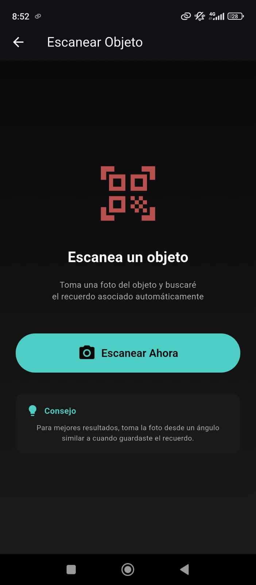

# 🧠 Memorias Ancladas


## 📖 Descripción

**Memorias Ancladas** es una aplicación móvil desarrollada para guardar recuerdos importantes mediante imágenes, ubicaciones y momentos especiales.  
La aplicación busca ayudar a las personas a conservar memorias personales de una forma visual e interactiva.

El proyecto está enfocado en ofrecer una experiencia simple, moderna y emocional para almacenar recuerdos digitales.

---

## ✨ Características

- 📸 Guardado de imágenes
- 📍 Ubicación de recuerdos
- 🗂️ Organización de memorias
- 📱 Interfaz moderna y responsiva
- ⚡ Rendimiento optimizado
- 🔒 Manejo seguro de datos locales

---

## 🛠️ Tecnologías utilizadas

### Frontend
- Flutter
- Dart

### Herramientas y paquetes
- Provider / Riverpod
- Image Picker
- Geolocator
- Shared Preferences
- SQLite / Hive

### Desarrollo
- Android Studio
- VS Code
- Git & GitHub

---

## 📷 Capturas de la aplicación

| Inicio | Crear memoria | Galería |
|---|---|---|
|  |  |

---


Estructura principal:

```bash
lib/
├── screens/
├── widgets/
├── services/
├── models/
├── controllers/
└── main.dart
```

---

## 🚀 Instalación

Clonar el repositorio:

```bash
git clone https://github.com/NiwreDev21/remember_me.git
```

Entrar al proyecto:

```bash
cd remember_me
```

Instalar dependencias:

```bash
flutter pub get
```

Ejecutar aplicación:

```bash
flutter run
```

---

## 📱 APK

Puedes probar la aplicación descargando el APK desde:

[Descargar APK](./apk/app-release.apk)

---


## 📄 Licencia

Este proyecto está bajo la licencia MIT.